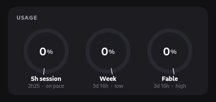
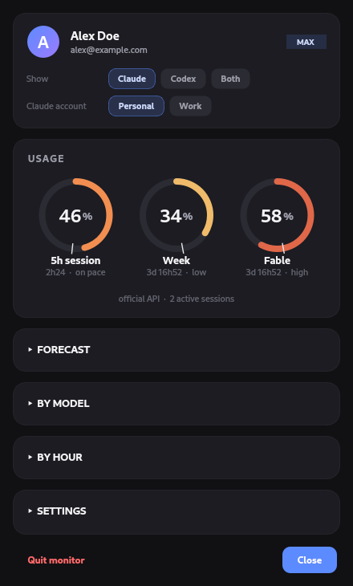
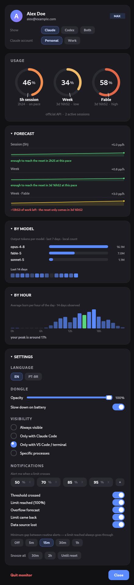
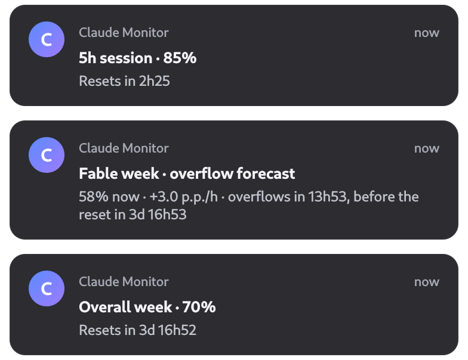

<div align="center">

# claude-dongle

**Your Claude Code usage limits, live — without breaking your flow.**

A floating pill that shows how much of your usage windows you've burned
(5-hour session and weekly, per model) and predicts when you'll hit the wall.
It reads everything from Claude Code's own local token: no proxy, no extra
login, nothing sent anywhere.

<br>


<br><br>

<a href="LICENSE"></a>


</div>

---

> **Unofficial.** This project is not affiliated with Anthropic. It reads the
> same undocumented usage endpoint that powers Claude Code's own limit
> warnings (`api.anthropic.com/api/oauth/usage`) — if Anthropic changes it,
> the monitor may stop showing data until updated.

## ✨ Features

- **Always-on dongle** — a discreet pill in the corner with your session (5h),
  week, and week-per-model usage. It appears only when it makes sense (e.g. with
  your editor or terminal open) and hides when you're not working.
- **Overflow forecast** — computes your *burn rate* by regression over recent
  usage and estimates the ETA to 100%. The border pulses amber when, at the
  current pace, you'll run out before the reset.
- **Pace marker** — every ring has a tick for *where you'd be at a linear pace*.
  Fill ahead of the tick = burning fast; behind it = comfortable. You read your
  pace at a glance, no math.
- **Per-project & per-model usage** — from Claude Code's local logs, it shows
  which projects and models ate your week (with a 14-day heatmap).
- **Limit notifications** — alerts when you cross a threshold and on the overflow
  forecast. Works even with the dongle closed, via a background timer.
- **Cross-platform** — Linux, macOS and Windows, with native autostart on each.

## 🖼️ Preview

<div align="center">
  
  <br>
  <em>The usage gauges, live</em>
</div>

<table>
  <tr>
    <td width="50%"></td>
    <td width="50%"></td>
  </tr>
  <tr>
    <td align="center"><em>Dashboard</em></td>
    <td align="center"><em>Forecast &amp; per-project usage, expanded</em></td>
  </tr>
</table>

<div align="center">
  
  <br>
  <em>Limit and overflow-forecast alerts — they fire even with the dongle closed</em>
</div>

## 📦 Installation

Requirements: **Python 3.9+** and **Claude Code** installed and logged in on the
machine.

With [pipx](https://pipx.pypa.io) (recommended — installs into an isolated env):

```bash
pipx install claude-dongle
```

Or with pip:

```bash
pip install --user claude-dongle
```

<details>
<summary>Install the latest unreleased version from source</summary>

```bash
pipx install git+https://github.com/PedroHenrique0713/claude-dongle
```

</details>

Then:

```bash
claude-dongle tray      # open the dongle
claude-dongle setup     # (optional) launch it automatically on login
```

`setup` wires up autostart the native way on each OS — **systemd user** on Linux,
**LaunchAgent** on macOS, **Startup folder** on Windows. Undo it with
`claude-dongle uninstall`.

## ⚙️ Usage

| Command | What it does |
|---|---|
| `claude-dongle tray` | open the floating dongle (normal use) |
| `claude-dongle status` | print the current state as JSON |
| `claude-dongle notify` | check the limits once and notify |
| `claude-dongle config` | open just the settings panel |
| `claude-dongle setup` | set up autostart on login |
| `claude-dongle uninstall` | remove autostart |

**Dongle interactions:** drag to reposition (it snaps to edges); click to open the
dashboard; middle-click to refresh now.

## 🔧 Configuration

Tune it from the panel or by editing `~/.config/claude-dongle/config.json`:

| Key | Default | Description |
|---|---|---|
| `thresholds` | `[50, 70, 85, 95]` | percentages that trigger a notification |
| `show_mode` | `"dev"` | when to show the dongle: `always`, `claude`, `dev` or `custom` |
| `poll_interval` | `5` | seconds between dongle refreshes |
| `api_poll_interval` | `300` | minimum interval between API calls (the endpoint rate-limits aggressive polling) |
| `dongle_opacity` | `0.85` | dongle opacity (0 to 1) |
| `notify_on_threshold` | `true` | notify when a threshold is crossed |
| `notify_on_limit` | `true` | notify when 100% is reached |
| `forecast_notify` | `true` | notify on a predicted overflow before the reset |
| `reset_day` / `reset_time` / `reset_timezone` | `null` | manual weekly-reset fallback, used only if the API never answered (`null` timezone = system local) |

## 🔍 How it works

Claude Code keeps an OAuth token in `~/.claude/.credentials.json` (on macOS, in
the Keychain). claude-dongle uses that token to query Anthropic's usage endpoint
(`api.anthropic.com/api/oauth/usage`) — the same one that powers Claude Code's own
limit warnings. From there:

- `monitor` assembles the state; with no real source (API down and no cache) it
  shows `--` instead of inventing a number.
- `history` keeps a local time series (SQLite) for the burn rate and forecast.
- `projects` aggregates tokens per project/model by reading the JSONL files in
  `~/.claude/projects`.
- `dongle` and `dashboard` (PyQt6, hand-drawn) render everything; `notifier`
  raises the alerts.

## 🔒 Privacy

Everything is local. The monitor **reads** Claude Code's token and talks
**directly** to Anthropic's official API — no data is sent to any third party, and
the token never leaves the machine nor gets rewritten (the monitor keeps what it
needs in its own cache, with owner-only file permissions, without touching Claude
Code's file).

## 🛠️ Development

Run from the repo without installing:

```bash
./run.sh tray                 # Linux/macOS
python -m claude_dongle tray  # any OS
```

Run the tests:

```bash
pip install pytest
pytest tests/
```

Regenerate the README assets (rendered by the app itself, offscreen, with
fictional data):

```bash
python scripts/gen_screenshots.py   # dongle, dashboard, notifications
python scripts/gen_gif.py           # the animated usage rings
```

## 📄 License

MIT © Pedro Henrique — see [LICENSE](LICENSE).
