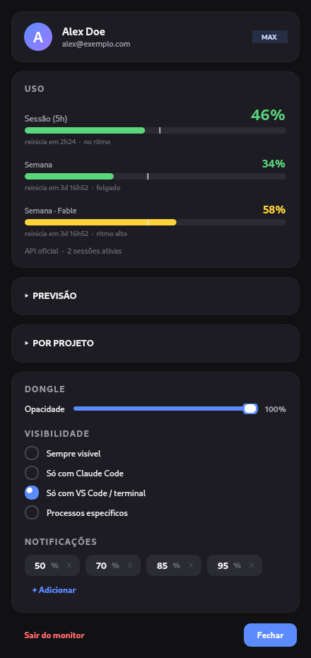
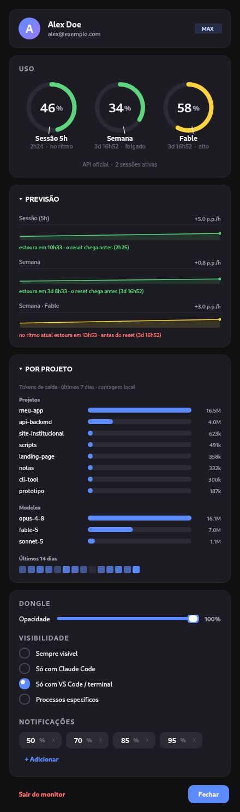
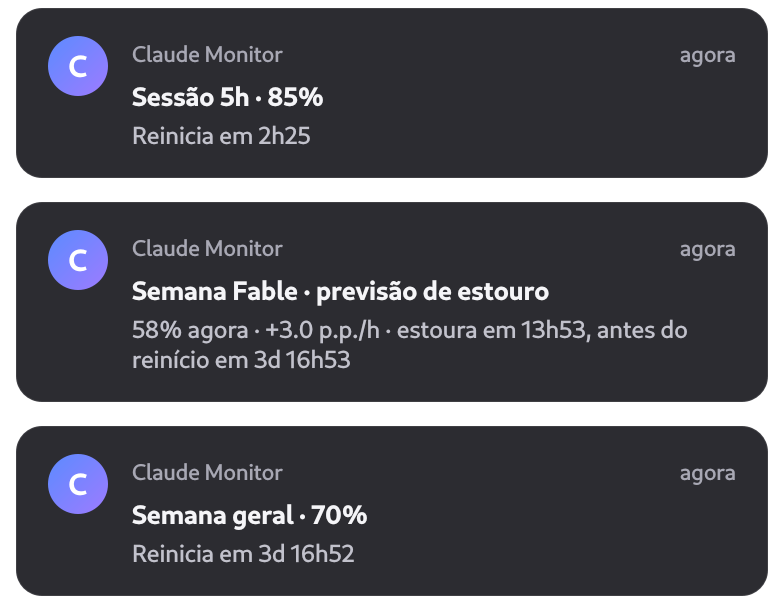

<div align="center">

# claude-monitor

**Seus limites do Claude Code em tempo real, sem sair do fluxo.**

Uma pílula flutuante que mostra quanto você já queimou das janelas de uso — sessão de 5h e semanal por modelo — e prevê quando você vai estourar. Lê tudo do token local do próprio Claude Code: sem proxy, sem login extra, sem enviar nada para lugar nenhum.


   

</div>

---

## O que faz

- **Dongle sempre à vista** — uma pílula discreta no canto da tela com sessão (5h), semana e semana por modelo. Aparece só quando faz sentido (ex. com o editor ou terminal aberto) e some quando você não está trabalhando.
- **Previsão de estouro** — calcula seu *burn rate* por regressão sobre o uso recente e estima o ETA até 100%. A borda pisca âmbar quando, no ritmo atual, você estoura antes do reset.
- **Barra de ritmo** — cada barra tem um marcador de "onde você estaria no ritmo linear". Preenchimento à frente do marcador = queimando adiantado; atrás = folgado. Você lê o ritmo de relance, sem interpretar número.
- **Uso por projeto e modelo** — a partir dos logs locais do Claude Code, mostra quais projetos e quais modelos consumiram a sua semana (com heatmap dos últimos 14 dias).
- **Notificações por limite** — avisa ao cruzar seus thresholds e na previsão de estouro. Funciona mesmo com o dongle fechado, via um timer que roda em segundo plano.
- **Multiplataforma** — Linux, macOS e Windows, com autostart nativo de cada sistema.

## Prévia

<table>
  <tr>
    <td width="50%"></td>
    <td width="50%"></td>
  </tr>
  <tr>
    <td align="center"><em>Painel</em></td>
    <td align="center"><em>Previsão e uso por projeto expandidos</em></td>
  </tr>
</table>

<div align="center">
  
  <br>
  <em>Avisos de limite e previsão de estouro — funcionam mesmo com o dongle fechado</em>
</div>

## Instalação

Requisitos: **Python 3.9+** e o **Claude Code** instalado e logado na máquina.

Com [pipx](https://pipx.pypa.io) (recomendado — instala num ambiente isolado):

```bash
pipx install git+https://github.com/PedroHenrique0713/claude-monitor
```

Ou com pip:

```bash
pip install --user git+https://github.com/PedroHenrique0713/claude-monitor
```

Depois:

```bash
claude-monitor tray      # abre o dongle
claude-monitor setup     # (opcional) faz subir sozinho no login deste SO
```

O `setup` configura o autostart do jeito nativo de cada sistema — **systemd user** no Linux, **LaunchAgent** no macOS, **pasta Iniciar** no Windows. Para desfazer: `claude-monitor uninstall`.

## Uso

| Comando | O que faz |
|---|---|
| `claude-monitor tray` | abre o dongle flutuante (uso normal) |
| `claude-monitor status` | imprime o estado atual em JSON |
| `claude-monitor notify` | checa os limites uma vez e notifica |
| `claude-monitor config` | abre só o painel de configuração |
| `claude-monitor setup` | configura o autostart no login |
| `claude-monitor uninstall` | remove o autostart |

**Interações do dongle:** arraste para reposicionar (gruda nas bordas); clique para abrir o painel; clique do meio para atualizar na hora.

## Configuração

Ajuste pelo painel ou editando `~/.config/claude-monitor/config.json`:

| Chave | Padrão | Descrição |
|---|---|---|
| `thresholds` | `[50, 70, 85, 95]` | percentuais que disparam notificação |
| `show_mode` | `"dev"` | quando mostrar o dongle: `always`, `claude`, `dev` ou `custom` |
| `poll_interval` | `5` | segundos entre atualizações do dongle |
| `api_poll_interval` | `300` | intervalo mínimo entre chamadas à API (o endpoint rate-limita polling agressivo) |
| `dongle_opacity` | `0.85` | opacidade do dongle (0 a 1) |
| `notify_on_threshold` | `true` | notificar ao cruzar um threshold |
| `notify_on_limit` | `true` | notificar ao atingir 100% |
| `forecast_notify` | `true` | notificar previsão de estouro antes do reset |

## Como funciona

O Claude Code guarda um token OAuth em `~/.claude/.credentials.json`. O claude-monitor usa esse token para consultar o endpoint oficial de uso da Anthropic (`api.anthropic.com/api/oauth/usage`) — o mesmo que alimenta os avisos de limite do próprio Claude Code. A partir daí:

- `monitor` monta o estado; sem fonte real (API fora e sem cache), mostra `--` em vez de inventar número.
- `history` mantém uma série temporal local (SQLite) para o burn rate e a previsão.
- `projects` agrega tokens por projeto/modelo lendo os JSONL de `~/.claude/projects`.
- `dongle` e `dashboard` (PyQt6, desenhados à mão) exibem tudo; `notifier` avisa nos limites.

## Privacidade

Tudo é local. O monitor **lê** o token do Claude Code e fala **direto** com a API oficial da Anthropic — nenhum dado é enviado a terceiros, e o token nunca sai da máquina nem é reescrito (o monitor guarda o que precisa em cache próprio, sem tocar no arquivo do Claude Code).

## Desenvolvimento

Rodar do repositório sem instalar:

```bash
./run.sh tray                 # Linux/macOS
python -m claude_monitor tray # qualquer SO
```
